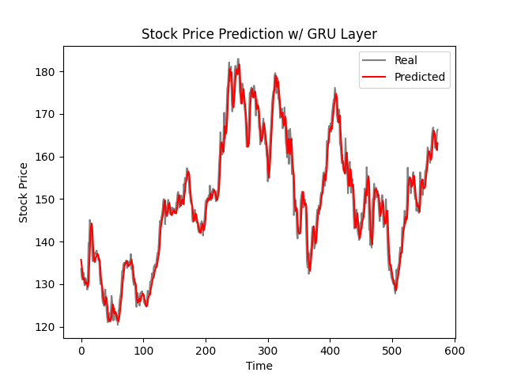

# Apple Stock Price Prediction

Thanks to yfinance it is possible to work with the dataframe of stock prices and ETFs.

The dataframe is a time series problem. In this solution the model uses a RNN.

Using a LSTM Bidirectional layer followed by dense relu layer and the output dense layer its possible to achieve root mean squared error is 3.58 and mean absolute error is 2.78.

With GRU we can have even faster training per epoch and better results, with 15 epochs it is already possible to achieve better results compared to LSTM.
With GRU Layer the root mean squared error is 2.93 and the mean absolute error is 2.30.

